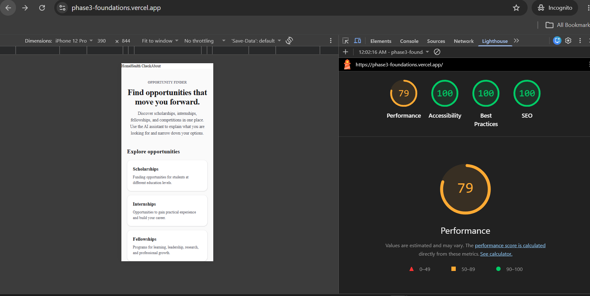
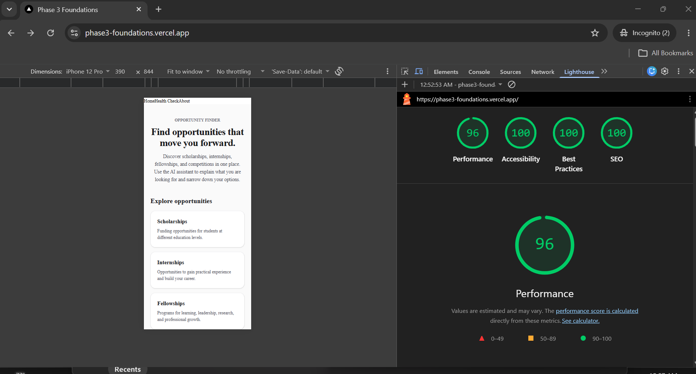

# FE-10 Accessibility and Performance Audit

## Overview

This audit documents the accessibility and performance evaluation of the Opportunity Finder application. Testing was performed against the deployed application using Lighthouse, WAVE, and manual keyboard testing.

The audit was completed in two stages: a baseline audit followed by improvements and a second Lighthouse audit to measure the results.

## 1. Lighthouse Baseline

The initial Lighthouse mobile audit produced the following baseline scores:

| Metric         | Before |
| -------------- | -----: |
| Performance    |     79 |
| Accessibility  |    100 |
| Best Practices |    100 |
| SEO            |    100 |

The baseline Performance score of 79 was below the FE-10 target of 90 and below the rubric's absolute minimum of 80.

The baseline Lighthouse screenshot is included below:



## 2. Improvements and Changes

The application was reviewed using the Lighthouse findings, with particular attention to JavaScript execution and page performance.

The initial audit identified JavaScript execution as the main performance concern, including high Total Blocking Time and unused JavaScript.

The application was then reviewed and verified without manually editing generated `.next` build files.

The accessibility implementation was also reviewed to ensure that the primary interaction flow remained keyboard accessible and that the AI chat provided appropriate feedback during streaming and tool activity.

## 3. Lighthouse After Audit

A second Lighthouse mobile audit was run after the improvements.

| Metric         | Before | After | Change |
| -------------- | -----: | ----: | -----: |
| Performance    |     79 |    96 |    +17 |
| Accessibility  |    100 |   100 |      0 |
| Best Practices |    100 |   100 |      0 |
| SEO            |    100 |   100 |      0 |

The final Performance score increased from **79 to 96**, an improvement of **17 points**.

Accessibility remained at **100**, exceeding the FE-10 requirement.

The final Lighthouse screenshot is included below:



## 4. WAVE Accessibility Audit

The deployed application was evaluated using the WAVE Web Accessibility Evaluation Tool.

Results:

* Errors: 0
* Contrast Errors: 0
* Alerts: 0
* Features: 2
* Structural Elements: 11
* ARIA: 6
* AIM Score: 10/10

WAVE reported no accessibility errors on the audited page.

## 5. Manual Keyboard Testing

The primary application flow was tested using keyboard navigation.

The following interactions were verified:

* The chat input can be reached using the keyboard.
* The Stop button can be reached using the keyboard while the assistant is responding.
* Interactive controls remain keyboard accessible.
* The primary chat interaction can be completed without relying on a mouse.

These checks complement the automated Lighthouse and WAVE results.

## 6. AI-Specific Accessibility

The Opportunity Assistant includes accessibility considerations for streamed AI interactions.

The conversation area uses a polite live region so that updates can be communicated without unnecessarily interrupting the user.

The chat also provides a keyboard-reachable Stop button while the assistant is responding, allowing users to stop streaming output using the keyboard.

Tool activity and errors are presented as visible interface states so users can understand when an opportunity search is being prepared, performed, completed, or unsuccessful.

## 7. Performance Findings

The baseline Lighthouse audit identified JavaScript execution as the main performance concern.

The baseline reported:

* Total Blocking Time: 890 ms
* Approximately 2.46 s total CPU time for first-party JavaScript
* Approximately 1.09 s of script evaluation
* Approximately 93.4 KiB estimated savings from unused JavaScript
* 10 long main-thread tasks
* 246 KiB total network payload

Important positive baseline results included:

* First Contentful Paint: 1.2 s
* Largest Contentful Paint: 1.6 s
* Cumulative Layout Shift: 0

The final Lighthouse Performance score improved to 96.

Generated `.next` build files were not manually edited because they are generated by Next.js.

## 8. Verification

The following commands were successfully completed:

```text
npm run lint
npm test
npm run build
```

Results:

* `npm run lint` — passed.
* `npm test` — passed.
* 1 test file passed.
* 8 tests passed.
* `npm run build` — passed successfully.

## 9. Test Coverage

The existing `OpportunityChat` component tests verify:

* First-run empty state.
* User messages.
* Assistant text responses.
* Searching state.
* Opportunity result cards.
* Tool error state.
* Pending Thinking state.
* Chat error and retry behaviour.

All 8 tests passed.

## Conclusion

The FE-10 audit demonstrates measurable improvement in the Opportunity Finder application's performance while maintaining strong accessibility.

Lighthouse Performance improved from **79 to 96**, a **17-point increase**. Accessibility remained at **100**, while Best Practices and SEO also remained at **100**.

WAVE reported zero errors and zero contrast errors. Manual keyboard testing confirmed that the primary chat interaction, including the Stop button during AI responses, is keyboard accessible.

The before and after Lighthouse screenshots are included in this document as `lighthouse-before.png` and `lighthouse-after.png`.

The application was successfully linted, tested, and built after the audit.
